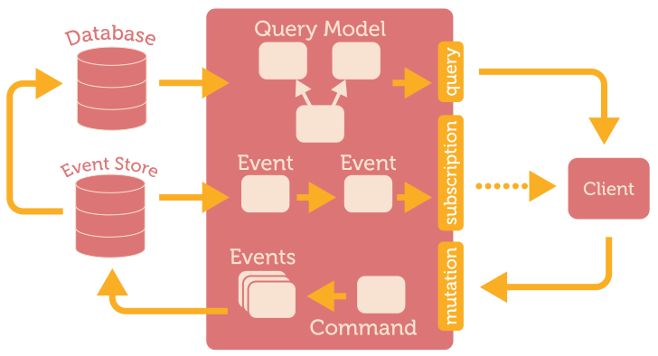

# GraphQl API

This is a GraphQL API that acts as a backend service for a shop app. It allows to store cart data using an **event-driven architecture**. It is an approximation to this kind of architecture implementing **event sourcing** and **CQRS** In other words, it registers any action as an event, stores it on the database and updates the entity related to that action. It includes user authentication.

## Index

- [Getting started](#getting-started)
  - [Installation](#installation)
  - [Environments](#environments)
  - [Usage](#usage)
  - [Docker](#docker)
  - [Mongo](#mongo)
- [Quick start](#quick-start)
- [Project decisions](#project-decisions)
  - [Framework choice](#framework-choice)
  - [Architecture](#architecture)
- [Business logic](#business-logic)
  - [Users](#users)
  - [Cart](#cart)
  - [Orders](#orders)
  - [Items](#items)
- [References](#references)

## Getting started

Please, follow this guide to correctly install and use this project.

### Installation

To install the project, first clone this repository (and star it if you like it 😉). Then, open a terminal on the project's directory and run:

```sh
$ npm install

or

$ yarn install
```

> You will need to have [Node](https://nodejs.org/es/) version 12 or higher in order to run this project

### Environments

Once the instalation of dependencies is completed, it is required to configure some environment variables. This project is prepared for two environments by default: dev (development) and prod (production).

In order to set the environment variables for any environment, you will need to create its corresponding file under a `environments` folder, just as it is shown below:

```sh
/environments
  .env.dev
  .env.prod
```

The environment variables available to configure are the following:

- `ENV`: The environment name.
- `PORT`: Port on which the process will listen.
- `JWT_SECRET`: JWT secret key. This is used to check if the authorization token provided by the client is valid.
- `JWT_EXPIRATION`: JWT expiration time in seconds. Time a generated token remains valid.
- `SALT_ROUNDS`: Bycript configuration. Defines de encripting complexity of any data in the API.
- `MONGO_URL`: Mongo Url to which the API needs to connect. The database name needs to be included in the url, as it is specified in the [official documentation](https://docs.mongodb.com/manual/reference/connection-string/).

An example of the configuration params will be the following:

```
ENV=example
PORT=3000
JWT_SECRET=DEV_SECRET
JWT_EXPIRATION=3600
SALT_ROUNDS=10
MONGO_URL=mongodb://localhost:27017/graphql
```

Additionaly, it is provided a [.env.example]() file to quick configure the `dev` or `prod` example. If no environment is set, all env variables have default values in code just in case they are not set and you want a quick start up.

### Usage

There are provided several script commands on the `package.json` that run the API on different environments. Those commands are specified below:

- `start`: Runs the API using the current `.env` configuration.
- `dev`: copies the `dev` environment variables on `/environments/.env.dev` into the `.env` file. Then runs the API.
- `prod`: copies the `prod` environment variables on `/environments/.env.prod` into the `.env` file. Then runs the API.

Both `dev` and `prod` commands are prepared for unix-based systems. However, this project has windows support. These are its equivalent commands:

- `wdev` (Windows): copies the `dev` environment variables on `/environments/.env.dev` into the `.env` file. Then runs the API.
- `wprod` (Windows): copies the `prod` environment variables on `/environments/.env.prod` into the `.env` file. Then runs the API.

### Docker

It is also prepared for [Docker](https://www.docker.com/) and [Docker Compose](https://docs.docker.com/compose/). In order to dockerize the project, you must first install and run docker on your device. The commands to run docker are:

- `docker`: Builds a docker image and runs it on port 5000. It uses a `docker` environment variables. In order to change the docker or localhost port, please modify the second part of the script, stablishing both ports as [the docker documentation states](https://docs.docker.com/config/containers/container-networking/):

```
$ docker run -p <CONTAINER_PORT>:<DOCKER_HOST>
```

- `compose`: Builds a docker compose app. This app consists on the `graphql-api`, listening on port 5000 and a mongo database, as stated in the [compose configuration file](./public/docker-compose.yml). It also uses the environment variables located on a `.env.docker` file in the environments folder. Additionally, in order to connect to the mongo service, the `MONGO_URL` variable must be set to `mongodb://mongodb:27018/graphql`, as shown below:

```
/environments/.env.docker
  ...
  ...
  MONGO_URL=mongodb://mongodb:27018/graphql
```

It is also provided a [docker compose prod environment file](./public/.env.compose) as example

> Both docker images use the `prod` environment, so be sure to have it configured on `/environments/.env.prod`

### Mongo

The selected persistance provider for this project is [mongoDB](https://www.mongodb.com). It is required for you to provide a connection string, which could be to a local instance or a remote database, such as [Mongo Atlas](https://www.mongodb.com/es/cloud/atlas).

If you choose to use a local connection, you must have a mongo daemon installed and running on your device. Please follow the [official instructions](https://www.mongodb.com/try/download/community)

Docker compose already sets up a mongo database as a service, so it is not required to have a local or remote database. With docker compose, you just need to connect your API container with your mongo container. In order to do so, the `MONGO_URL` variable must be set to `mongodb://mongodb:27018/graphql`.

## Quick start

This project can be easily tested running the docker-compose app and using [Hoppscotch](https://hoppscotch.io/es/graphql). This repository contains a [hoppscotch collection](./public/hoppscotch.json) that contains all the queries, subscriptions and mutations that can be done on the app. You just need to import the file on [Hoppscotch](https://hoppscotch.io/es/graphql) and have fun 😄!!

Reminder that the compose app will be running on port 5000.

## Project decisions

This section will serve as an statement (and reminder for my future self 😅) about all key decisions made through the development of this project. The basic objective of this project is to build a GraphQl API using an event-driven architecture.

### Framework choice

[Official GraphQL documentation](https://graphql.org/code/#javascript) offers a wide variety of frameworks for NodeJS applications. Given my experience with [Express](https://expressjs.com/es/), the options were narrowed to two: [Apollo Server](https://github.com/apollographql/apollo-server) and [Express GraphQL](https://github.com/graphql/express-graphql).

After reading and trying both libraries, I did not seen any difference other than simplicity. I started with the simpler one (express graphql), since both fulfilled the project's requirements. However, with subscriptions and authentication, the project's complexity increased and it was necesary to upgrade into apollo server.

### Architecture

The project's architecture is event driven. In order to do so, it was also considered necesary to implement a basic event sourcing system and CQRS. The project's architecture follows the diagram shown below:



The project structure tries to resemble as much as possible this diagram, adapted and simplified to fulfill the requirements of the project. This leads to the following project structure:

- `event-store`: Contains everything necesary for the event store to work, including components such as an `event-type.enum` where all types of events are declared. It also has an `event.handler`, that acts as a kind of reducer. The event handler receives an event after its registered in the system and calls its corresponding handler to perform the corresponding actions, such as storing a new snapshot of an entity.

- `graphql`: This folder contains all graphQL specifications, grouped by entities. Each entity folder contains the following:

  - `resolver`: This contains all queries, mutations and subscriptions related to the event. It handles them, sending the corresponding event to the event store if required and sending back a response to the client. It can be said that the resolver acts both as a commander and as a request handler. Given the simplicity of the project, it wasn't considered necesary to separate those responsabilities into two files.

  - `events`: This folder contains all different events that can be triggered and are related to an entity.

  - `handlers`: This folder contains all handlers for the different events that can be triggered and are related to an entity.

  - `dtos`: This folder contains all different DTOs or GraphQL schema specifications. It defines all GraphQL input and output entities.

  - `model`: It acts as a wrapper of all the database operations that can be done to that entity. It makes operations agnostic to the database used to store the data related to the entity and makes them more semantic. It also may include non database operations, such as calculating something from a given state.

- `middlewares`: Very common piece of software. It's purpose is to perform an operation before a request is processed or after a response is sent. In this project, there is one middleware, the authentication middleware. It's sole purpose is to authenticate all protected requests. If a request can't be authenticated, it will not be processed.

- `repository`: It contains all database interface entities. In this case, there is just a mongo repository, which contains an entity class for each entity stored it the database.

- `services`: Pieces of software that contain functions related to a certain service. For example, the authentication service contains all functions related to authentication and that can be used by other entities in the API.

- `types`: contains basic and common Typescript types and enums.

## Business logic

The business logic of this API is very simple. This project's aim is to provide a simple cart management API. Therefore, it has the following entities:

- Users
- Carts
- Orders

### Users

This API can only be used by registered people. The registration is done by email and password. No other data is stored. This are the operations that can be done on users:

#### Mutations

- `logIn`: send a email and password in order to obtain a token to access the API.
- `signUp`: register a new user by providing an unregistered email and password. If successful it will automatically log in and return a token to access the API.

### Cart

The main point of the business. It consists on a set of items, an address to which the items in the cart will be delivered, a total price and the id of the user to which it belongs. There can only be one cart per user. This are the operations that can be done on carts:

#### Queries

- `getCart`: get the cart of the user that is making the request.

#### Subscriptions

- `subscribeToCart`: subscribe to the status of the cart that belongs to the user that is making the request.

#### Mutations

- `createCart`: it creates a cart and assigns to the user that made the request. If the user already has a cart, it will return an error to the client.

- `updateItemInCart`: update an item on a cart. If the cart already contains that item, it will set the quantity of that item with the quantity sent on the request. If the cart doesnt contain the item, it will add it to the cart with the provided quantity. If the provided quantity is 0, it will remove the item from the cart. If the cart has not been created yet, it will create it before adding the item. Negative quantity of items is allowed since it can mean that an item is returned by a user.

- `updateAddress`: update the address to which all items in the cart will be delivered once an order is placed.

- `clearCart`: reset all cart items. This may be called after a cart payment is confirmed. The cart won't be cleared automatically once an order is made to give the user the possibility to make another order with the same items (and deliver it to a different address, for example).

### Orders

This stores the items that need to be sent to a user. It will also store a payment confirmation BLOB and a address to which the items will be delivered. A user can have more than one order at a time.

#### Queries

- `getOrder`: get an order by its id. The provided id must be of an order that belongs to the user that makes the request.

- `getOrderStatus`: get an order current status. The possible status of an order are the following:

  - `Pending`: The order has been generated but it has neither been confirmed or cancelled.
  - `Confirmed`: The payment has been confirmed and the order has the payment confirmation BLOB stored.
  - `Cancelled`: The order has been cancelled.

#### Mutations

- `createOrder`: it creates a new order. This order will contain the items that are in the user's cart at the moment the order is created. It will also store the address that the cart has at the moment is created. The cart must have at least one item and a deliver address when the order is created, otherwise it will throw an error.

- `confirmPayment`: stores the payment confirm BLOB sent in the request. This may update the status of the order. A payment can be confirmed if the order is cancelled in order to store the payment blob just in case something went wrong and the quantity paid needs to be returned (eg. the order is cancelled before the payment is bank confirms the payment). An order can be confirmed several times (to update the confirmation BLOB)

- `cancelOrder`: cancels an order. This may update the status of the order. An order can't be cancelled if it is already cancelled.

### Items

This entity does not have any query or mutation by itself. It represents an item that can be added to a cart and ordered. Each item has an unique identifier, the `sku`. Two models of one product with different size and color will have different sku.

## References

Below are listed some of the most interesing and important references I used during the development of this project:

- [Event sourcing by Martin Fowler](https://martinfowler.com/eaaDev/EventSourcing.html)
- [Event Sourcing in practice](https://ookami86.github.io/event-sourcing-in-practice/)
- [Event Sourcing and Concurrent Updates](https://teivah.medium.com/event-sourcing-and-concurrent-updates-32354ec26a4c)
- [Event Sourcing with Examples in Node.js](https://blog.risingstack.com/event-sourcing-with-examples-node-js-at-scale/)
- [Event-stream based GraphQL subscriptions for real-time updates](https://gist.github.com/OlegIlyenko/a5a9ab1b000ba0b5b1ad)
- [Event driven API Strategies: from WebHooks to GraphQL Subscriptions](https://www.youtube.com/watch?v=E_0tSNHWwWA&t=1132s&ab_channel=NordicAPIs)
- ["Turning the database inside out with Apache Samza" by Martin Kleppmann](https://www.youtube.com/watch?v=fU9hR3kiOK0&t=477s&=StrangeLoopConference)
- [GraphQL Typescript Authentication Boilerplate](https://www.youtube.com/watch?v=OVdPOExxKuU&=BenAwad)
- [Typescript GraphQL CRUD Tutorial](https://www.youtube.com/watch?v=WhzIjYQmWvs&t=1261s&ab_channel=BenAwad)
- [Typescript & GraphQL | TypeORM, Type-GraphQL y ApolloServer](https://www.youtube.com/watch?v=mNsvOon1L_c&t=2508s&ab_channel=FaztCode)
- [Typescript & GraphQL | TypeORM, Type-GraphQL y ApolloServer](https://www.youtube.com/watch?v=mNsvOon1L_c&t=2508s&ab_channel=FaztCode)
